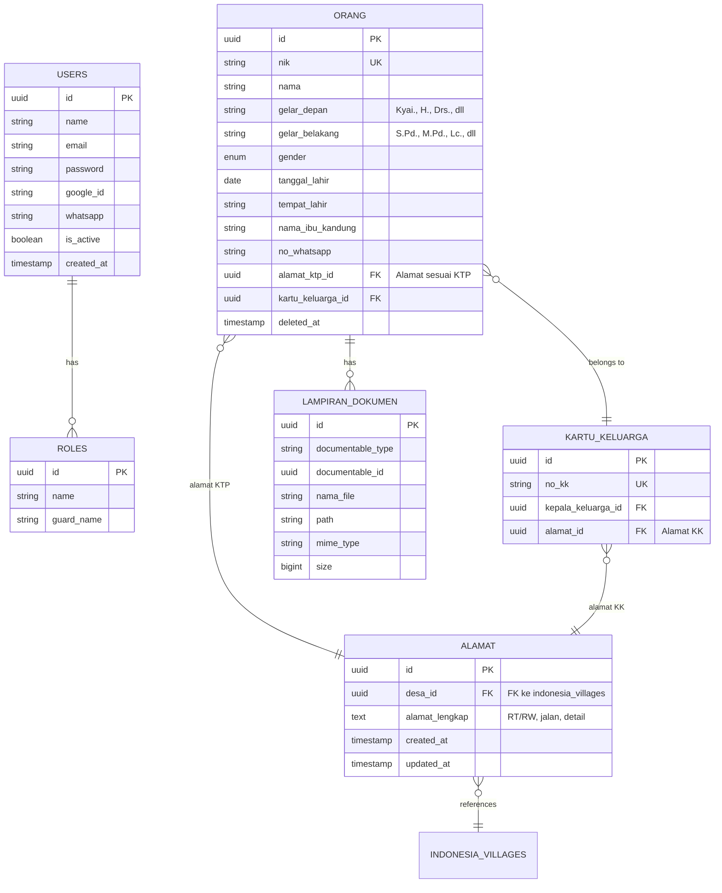

# 🏗️ FASE 1: Fondasi & Manajemen Orang (Core & People Management)

---

> **Fokus**: Membangun infrastruktur dasar, autentikasi user, dan manajemen database sentral manusia (orang). Tanpa fase ini, fase lainnya tidak bisa jalan.

---

## 1.1 Fitur Utama (Scope)

### 🚀 System Bootstrapping

- Instalasi awal & Database Seeder (User root, Role Super Admin)
- Integrasi package `laravolt/indonesia` untuk data wilayah
- Setup Redis untuk caching data wilayah

---

### 🔐 Authentication & RBAC (Role-Based Access Control)

| Fitur | Deskripsi |
|-------|-----------|
| **Google OAuth** | Login utama via Google account |
| **Email/Password** | Login alternatif (configurable) |
| **WhatsApp OTP** | Login via OTP WhatsApp (configurable) |
| **Forgot Password** | Reset password via email |
| **Manajemen Roles** | Buat role: Super Admin, Staf HR, Panitia PSB, dll |
| **Manajemen Permissions** | Hak akses per fitur (CRUD per modul) |
| **Manajemen Users** | Create, Update, Suspend, Assign Role |

---

### 👥 People Management (CRUD Orang)

- Input data orang (NIK, Nama, Gender, Tanggal Lahir, Tempat Lahir)
- Input data alamat dengan lazy-loading dropdown (Provinsi → Kota → Kecamatan → Desa)
- Input data `kartu_keluarga` & `anggota_keluarga` (Legal structure)
- **Logic**: Cek duplikasi NIK & Soft Delete (Restore data orang lama)

---

### 📁 Global File Storage (Technical Foundation)

- Siapkan tabel `lampiran_dokumen` (Polymorphic) agar siap dipakai di fase berikutnya
- Konfigurasi storage driver (local/S3)

---

## 1.2 Tabel Database

---

## ✅ Definition of Done (Target Selesai Fase 1)

> Admin bisa login (Google/Password/WhatsApp), membuat user lain, memberi hak akses, dan menginput data penduduk (nama, alamat dengan dropdown wilayah, KK) meskipun orang tersebut belum punya jabatan apa-apa (belum jadi santri/pegawai).

---

## 📋 Checklist Implementasi

- [ ] Setup Laravel 12 dengan PostgreSQL
- [ ] Integrasi laravolt/indonesia
- [ ] Setup Redis caching
- [ ] Implementasi Google OAuth (Laravel Socialite)
- [ ] Implementasi login Password (configurable)
- [ ] Implementasi login WhatsApp OTP (configurable)
- [ ] Setup Spatie Permission (RBAC)
- [ ] CRUD Orang dengan validasi NIK
- [ ] CRUD Kartu Keluarga
- [ ] Lazy-loading dropdown Wilayah
- [ ] Setup Polymorphic file storage

---

[Fase 2: HRIS →](./fase-2-hris)
