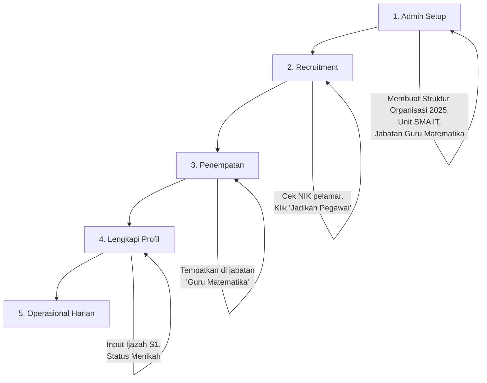

# 🏢 FASE 2: HRIS & Organisasi Dinamis

---

> **Tujuan Utama**: Mengubah data "Orang" (dari Fase 1) menjadi "Pegawai" yang memiliki jabatan, NIP, riwayat karir, dan catatan khusus dalam struktur organisasi pesantren yang bisa berubah setiap periode.

---

## 📊 MODUL 2.1: Struktur Organisasi Dinamis (The Foundation)

Fitur ini memungkinkan pesantren mengubah struktur organisasi (misal: memecah divisi, mengganti nama unit) di tahun ajaran baru **tanpa merusak data histori** tahun sebelumnya.

### A. Tabel Database Pendukung

| Tabel | Kolom | Fungsi |
|-------|-------|--------|
| `struktur_organisasi` | `id`, `nama_periode`, `tgl_mulai`, `tgl_selesai`, `is_active` | Wadah utama. Hanya satu periode yang boleh `is_active = 1` |
| `unit_organisasi` | `id`, `struktur_id` (FK), `parent_id` (Self-join), `nama_unit`, `kode_unit`, `level_hierarki`, `urutan` | Menyimpan hierarki (Yayasan → Pendidikan → SMA → Tata Usaha). `kode_unit` untuk kode seperti "TMI", "SMA-IT". `urutan` untuk sorting display |
| `master_jabatan` | `id`, `unit_organisasi_id` (FK), `nama_jabatan`, `is_pimpinan`, `kuota_sdm` | Posisi spesifik yang tersedia dalam unit tersebut |

### B. Kebutuhan Fungsional (Fitur)

| Kode | Fitur | Deskripsi |
|------|-------|-----------|
| **ORG-01** | Create & Clone Period | Admin bisa membuat periode baru dari nol. Fitur **Clone**: menyalin seluruh struktur dari periode 2024 ke 2025, lalu melakukan penyesuaian |
| **ORG-02** | Organization Tree View | Visualisasi struktur berbentuk bagan pohon (Parent-Child) agar mudah melihat alur komando |

---

## 👔 MODUL 2.2: Manajemen Profil Pegawai (The Actor)

Mengaktifkan peran pegawai pada data orang yang sudah ada.

### A. Tabel Database Pendukung

| Tabel | Kolom | Fungsi |
|-------|-------|--------|
| `peran_pegawai` | `id`, `orang_id` (FK), `nip`, `tgl_bergabung`, `tmt`, `status_kepegawaian`, `status_mukim`, `alamat_domisili_id` (FK), `is_pengajar`, `nfc_id`, `finger_id`, `email_internal`, `no_rekening`, `nuptk`, `foto_url`, `tgl_resign`, `is_active` | Data kepegawaian lengkap. `foto_url` untuk foto pegawai |
| `histori_jabatan_pegawai` | `id`, `peran_pegawai_id`, `master_jabatan_id` (FK), `spesialisasi`, `no_sk`, `tgl_mulai`, `tgl_selesai`, `keterangan_mutasi`, `is_jabatan_fungsional` | Mencatat perjalanan karir. `spesialisasi` untuk bidang keahlian (misal: "program management pendidikan islam"). `is_jabatan_fungsional = true` untuk jabatan seperti Wali Kamar, Wali Kelas (bisa multiple record per pegawai) |

### Penjelasan Status Kepegawaian

| Status | Keterangan |
|--------|------------|
| `Guru Tetap` | Guru dengan status tetap |
| `Guru Kontrak` | Guru dengan kontrak waktu tertentu |
| `Karyawan Tetap` | Karyawan non-pengajar dengan status tetap |
| `Karyawan Kontrak` | Karyawan non-pengajar dengan kontrak |
| `Honorer` | Pegawai honorer |

### B. Kebutuhan Fungsional (Fitur)

| Kode | Fitur | Deskripsi |
|------|-------|-----------|
| **EMP-01** | Employee Activation (Assign Role) | Mencari data orang berdasarkan NIK/Nama. Jika belum ada, create orang baru. Jika sudah ada (misal: dia Wali Santri), langsung aktifkan peran pegawainya |
| **EMP-02** | NIP Input | Input NIP secara manual (sesuai kebijakan pesantren) |
| **EMP-03** | Mutasi & Promosi | Saat pegawai pindah jabatan, sistem otomatis mengisi `tgl_selesai` pada jabatan lama dan membuat baris baru di `histori_jabatan_pegawai` dengan `tgl_mulai` hari ini |

---

## 📝 MODUL 2.3: Riwayat Hidup & Catatan Khusus (The History)

Mencatat detail kehidupan pegawai yang mempengaruhi HR, termasuk fitur **Custom Attributes**.

### A. Tabel Database Pendukung

| Tabel | Kolom | Fungsi |
|-------|-------|--------|
| `riwayat_pendidikan` | `id`, `orang_id` (FK), `jenjang`, `institusi`, `jurusan`, `tahun_masuk`, `tahun_lulus`, `nilai_akhir`, `no_ijazah` | Riwayat pendidikan formal. Jenjang: SD/SMP/SMA/D1/D2/D3/S1/S2/S3/Pesantren/Lainnya |
| `riwayat_keluarga_pegawai` | `id`, `peran_pegawai_id`, `status`, `nama_pasangan`, `jumlah_anak`, `tgl_perubahan_status`, `keterangan` | Status: Lajang/Menikah/Cerai Hidup/Cerai Mati |
| `riwayat_ibadah` | `id`, `peran_pegawai_id`, `jenis`, `tanggal_rencana`, `tanggal_berangkat`, `status`, `keterangan` | **TABEL BARU** untuk tracking Umroh/Haji. `jenis`: UMROH/HAJI. `status`: RENCANA/SUDAH |
| `catatan_kepegawaian` | `id`, `peran_pegawai_id`, `kategori`, `judul`, `deskripsi`, `tgl_kejadian`, `poin` | Generic log untuk prestasi, pelanggaran, kesehatan, dll |

### Kategori Catatan Kepegawaian

| Kategori | Contoh Penggunaan |
|----------|-------------------|
| `PRESTASI` | Penghargaan, sertifikasi |
| `PELANGGARAN` | SP 1, SP 2, SP 3 |
| `KESEHATAN` | Cuti sakit panjang |
| `LAINNYA` | Catatan lain-lain |

> **Note**: Untuk data Umroh/Haji sekarang menggunakan tabel `riwayat_ibadah` yang terpisah agar lebih mudah di-filter dan tracking status (RENCANA/SUDAH).

### B. Kebutuhan Fungsional (Fitur)

| Kode | Fitur | Deskripsi |
|------|-------|-----------|
| **REC-01** | Custom Event Logger | Form input fleksibel untuk mencatat kejadian |
| **REC-02** | Education History Tracker | Input data ijazah. Jika pegawai lanjut S2 saat bekerja, data S2 ditambahkan tanpa menghapus data S1 |

---

## 📄 MODUL 2.4: Dokumen & Administrasi (The Compliance)

Memastikan kelengkapan berkas administrasi pegawai.

### A. Tabel Database Pendukung

| Tabel | Fungsi |
|-------|--------|
| `master_dokumen_wajib` | Filter `wajib_untuk = 'PEGAWAI'` |
| `checklist_dokumen_pegawai` | Daftar dokumen yang harus dikumpulkan per pegawai |
| `lampiran_dokumen` | Polymorphic table untuk menyimpan file |

### B. Kebutuhan Fungsional (Fitur)

| Kode | Fitur | Deskripsi |
|------|-------|-----------|
| **DOC-01** | HR Document Checklist | Sistem otomatis menagih dokumen saat seseorang jadi pegawai: KTP, NPWP, Ijazah Terakhir, Sertifikat Pendidik, SKCK |
| **DOC-02** | Expiry Reminder *(Opsional)* | Notifikasi jika ada dokumen yang punya masa berlaku habis (misal: SIM Driver, STR Tenaga Medis) |

---

## 🔄 Rangkuman Alur Kerja User (User Flow)

### Detail Operasional Harian

| Timeline | Kejadian | Aksi |
|----------|----------|------|
| Bulan depan | Pegawai terlambat | Input ke `catatan_kepegawaian` → SP 1 |
| Tahun depan | Pegawai Umroh | Input ke `riwayat_ibadah` → jenis UMROH, status SUDAH |
| Tahun depannya lagi | Promosi | Update jabatan → "Kepala Sekolah" (Mutasi) |

---

## ✅ Definition of Done (Target Selesai Fase 2)

> Admin HR bisa membuat struktur organisasi, mengaktifkan pegawai dari data orang, menempatkan di jabatan, mencatat riwayat pendidikan/keluarga, dan mengelola catatan kepegawaian.

---

## 📋 Checklist Implementasi

### MODUL 2.1: Struktur Organisasi
- [ ] CRUD Struktur Organisasi (Periode)
- [ ] CRUD Unit Organisasi (Tree structure)
- [ ] CRUD Master Jabatan
- [ ] Clone Period functionality
- [ ] Tree View visualization (Vue component)

### MODUL 2.2: Profil Pegawai
- [ ] Employee Activation (Orang → Pegawai)
- [ ] NIP input dengan unique validation
- [ ] Histori Jabatan tracking
- [ ] Mutasi & Promosi workflow

### MODUL 2.3: Riwayat & Catatan
- [ ] CRUD Riwayat Pendidikan
- [ ] CRUD Riwayat Keluarga
- [ ] CRUD Riwayat Ibadah (Umroh/Haji)
- [ ] CRUD Catatan Kepegawaian (Custom Event Logger)

### MODUL 2.4: Dokumen
- [ ] Master Dokumen Wajib (seed data)
- [ ] Checklist Dokumen per Pegawai
- [ ] Upload & Verifikasi Dokumen
- [ ] Expiry Reminder (optional)

---

[← Fase 1: Fondasi](./fase-1-fondasi) | [Fase 3: Santri →](./fase-3-santri)
