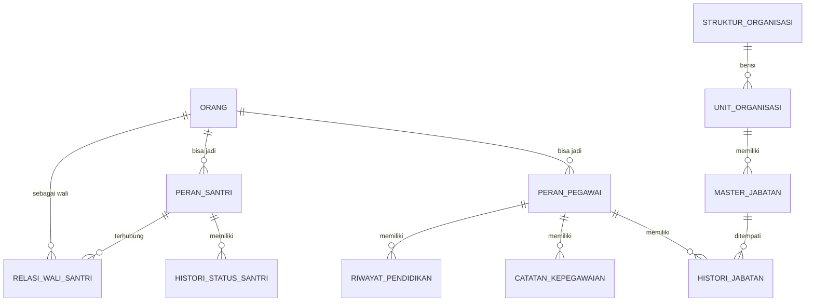

# 📋 Roadmap Pengembangan Sistem PeduliKu

> **PeduliKu** adalah sistem manajemen terpadu untuk pesantren yang mencakup manajemen orang, kepegawaian (HRIS), dan akademik santri.

---

## 📁 Struktur Dokumentasi

| Dokumen | Deskripsi |
|---------|-----------|
| [Tech Stack](./tech-stack) | Arsitektur sistem, teknologi yang digunakan |
| [Keputusan Desain](./design-decisions) | Keputusan arsitektur yang telah disepakati |
| **Fase Pengembangan** | |
| [Fase 1: Fondasi & Manajemen Orang](./fase/fase-1-fondasi) | Core & People Management |
| [Fase 2: HRIS & Organisasi](./fase/fase-2-hris) | Kepegawaian & Struktur Organisasi |
| [Fase 3: Santri & Akademik](./fase/fase-3-santri) | Manajemen Santri *(coming soon)* |

---

## 🎯 Fokus Saat Ini

:::important
Saat ini fokus pengembangan adalah **Fase 1** dan **Fase 2** karena merupakan fondasi fundamental sistem.
:::

```
┌─────────────────────────────────────────────────────────────────┐
│                    PRIORITAS PENGEMBANGAN                       │
├─────────────────────────────────────────────────────────────────┤
│                                                                 │
│   ┌─────────────┐     ┌─────────────┐     ┌─────────────┐      │
│   │   FASE 1    │ ──► │   FASE 2    │ ──► │   FASE 3    │      │
│   │  Fondasi &  │     │   HRIS &    │     │  Santri &   │      │
│   │   Orang     │     │ Organisasi  │     │  Akademik   │      │
│   │             │     │             │     │             │      │
│   │  🔵 FOKUS   │     │  🔵 FOKUS   │     │  ⚪ NANTI   │      │
│   └─────────────┘     └─────────────┘     └─────────────┘      │
│                                                                 │
└─────────────────────────────────────────────────────────────────┘
```

---

## 📊 Ringkasan Arsitektur Database (Entity Relationship)



---

## 📌 Catatan Pengembangan

:::important
Setiap fase harus diselesaikan secara berurutan karena ada ketergantungan data antar fase.
:::

:::tip
Gunakan fitur **Clone Period** pada MODUL 2.1 untuk mempercepat setup struktur organisasi di tahun ajaran baru.
:::

---

*Dokumen ini dibuat untuk roadmap pengembangan sistem PeduliKu v3*
